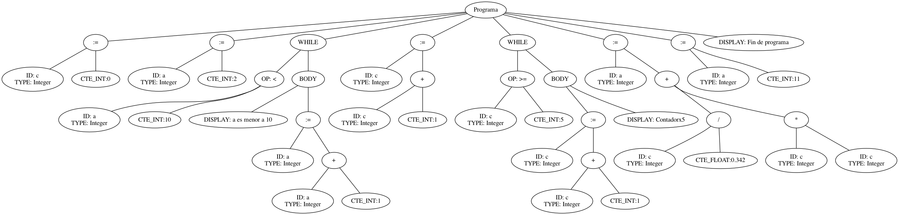

# Compiladores

## Entregas

### Primera Entrega

Para ejecutar la primer entrega correr el jar dentro de `primera-entrega/Analizador.jar`. Los archivos de pruebas utilizados se encuentran en la carpeta `primera-entrega/pruebas`

La sintaxis del lenguaje sigue los siguientes ejemplos:

```sql
--/ Esto es un comentario /--
--/ Declaracion de variables /--
DECLARE.SECTION
    INT : a, b , c; --/ Entero /--
    FLOAT : d, e; --/ Float /--
    STRING : j, g, h, i; --/ String /--
    BOOL : o, p; --/ Boolean /--
ENDDECLARE.SECTION

--/ Comienzo de Programa /--
PROGRAM.SECTION

--/ Asignaciones /--
c := 0;
a := 2;

--/ While /--
WHILE (a < 10) {
    DISPLAY "a es menor a 10";
    a := a + 1;
}
c := c+1;

--/ If /--
IF ((c >= 5) && (c <= 10)) {
    c:= c + 1;
    DISPLAY "Contadorx2";
}
IF ((c <= 5) || (c >= 10)) {
    c:= c + 1;
    DISPLAY "Contadorx2";
}
a := (c/0.342) + (c*c);

--/ Esto es una salida por pantalla /--
DISPLAY "Fin de programa";

--/ If Unario /--
var1 := ?((i==h),a*2,a*0);

ENDPROGRAM.SECTION
```

### Segunda Entrega

En esta entrega, se agrega la funcionalidad de la generación del arbol AST.

Para la ejecución se debe abrir una terminal sobre en directorio `segunda-entrega` y ejecutar el siguiente comando:

```bash
java -jar Analizador.jar
```

> Nota: El codigo fue probado en Linux y MacOS, por lo que para que corra en Windows se debe cambiar el comando para ejecutar graphviz (`dot`)por el equivalente en dicha plataforma.

Ejemplo de resultado de generación del arbol AST


